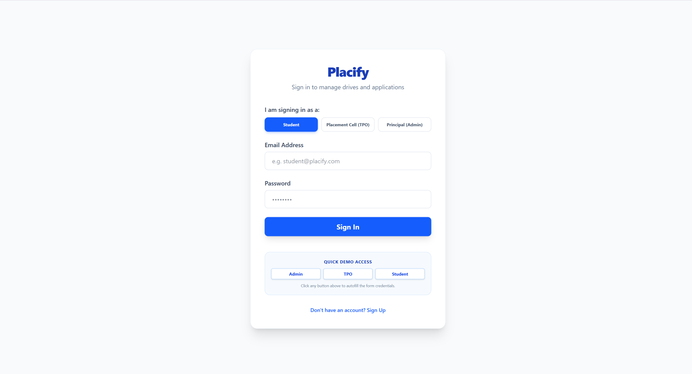
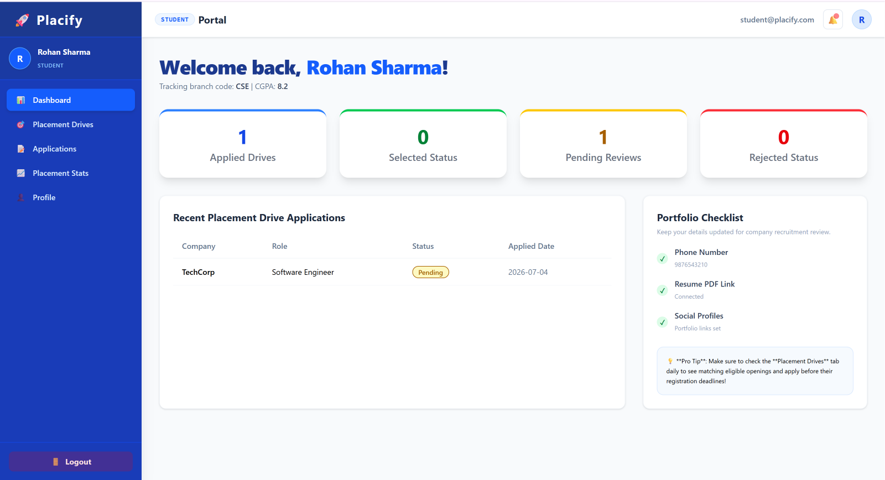
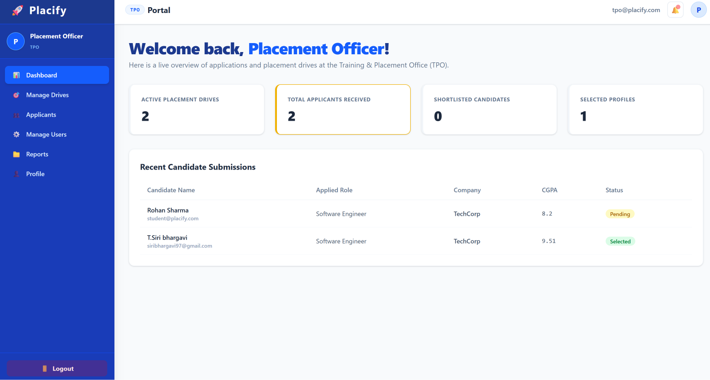
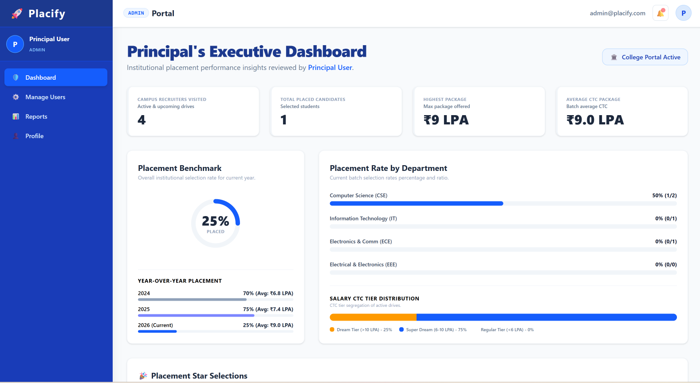

# 🚀 Placify

> **Full-Stack MERN-Based Campus Recruitment & Placement Management Platform**


Placify is a **full-stack MERN application** designed to streamline campus recruitment by connecting **Students**, **Training & Placement Officers (TPOs)**, and **Administrators** on a single platform.

The platform automates the complete placement lifecycle—from student registration and profile verification to job applications, recruitment stages, selection tracking, email notifications, and placement analytics.

---

## 🌐 Live Demo

**🔗 Live Application:**  
https://placify-f81j.onrender.com

**💻 GitHub Repository:**  
https://github.com/siribhargavi-t/Placify

---

# ⭐ Key Highlights

- 🚀 Full MERN Stack Application
- 🔐 JWT Authentication
- 👥 Role-Based Access Control (RBAC)
- 📧 Automated Email Notifications using Nodemailer
- 🏢 Placement Drive Management
- 📊 Placement Analytics Dashboard
- 📄 Resume Upload & Profile Verification
- 🎯 Eligibility Calculator
- 🕒 Student Activity Timeline
- ☁️ MongoDB Atlas Integration
- 🌐 Live Deployment on Render
- 📱 Responsive User Interface

---

# 📌 Table of Contents

- [Features](#-features)
- [Tech Stack](#-tech-stack)
- [System Architecture](#-system-architecture)
- [Folder Structure](#-folder-structure)
- [User Roles](#-user-roles)
- [Application Workflow](#-application-workflow)
- [REST API Overview](#-rest-api-overview)
- [Database Models](#-database-models)
- [Installation](#-installation)
- [Environment Variables](#-environment-variables)
- [Demo Credentials](#-demo-credentials)
- [Screenshots](#-screenshots)
- [Future Enhancements](#-future-enhancements)

---

# ✨ Features

## 🔐 Authentication & Security

- JWT Authentication
- Secure Password Hashing using bcrypt
- Role-Based Access Control (RBAC)
- Protected Frontend Routes
- Protected Backend APIs
- Session Restoration
- Student Verification Workflow
- Account Suspension / Activation
- Secure REST APIs

---

## 👨‍🎓 Student Features

- Student Dashboard
- Placement Readiness Indicator
- Academic Eligibility Calculator
- Browse Placement Drives
- Search & Filter Drives
- One-Click Job Applications
- Resume Upload
- GitHub & LinkedIn Portfolio Links
- Activity Timeline
- Application History
- Verification Status Banner
- Notification Center

### 📌 Placement Rules

- Profile must be verified before applying
- Resume upload is mandatory
- Maximum 3 active applications
- Dream Upgrade Policy
- Automatic eligibility checking based on:
  - Department
  - CGPA
  - Attendance
  - Backlogs

---

## 👨‍💼 Training & Placement Officer (TPO)

- Dashboard Analytics
- Placement Drive CRUD Operations
- Student Verification
- Applicant Management
- Recruitment Stage Progression
- Bulk Candidate Updates
- CSV Export
- Search & Filtering
- Feedback Management

---

## 👨‍💼 Admin Features

- Overall Placement Statistics
- Department-wise Reports
- User Management
- Account Suspension
- Placement Analytics Dashboard
- Reports Generation

---

## 📧 Email Notifications

Automatic emails are sent whenever a student's application status changes.

Supported email templates include:

- 📝 Aptitude Test
- 💻 Technical Interview
- 👤 HR Interview
- 🎉 Selected
- ❌ Rejected

Powered by **Nodemailer** using responsive HTML email templates.

---

## 🔔 Notification System

- Student Notifications
- TPO Notifications
- Admin Notifications
- Broadcast Notifications
- Toast Alerts
- Real-Time Status Updates
# 🛠 Tech Stack

## 🎨 Frontend

- React.js
- Vite
- React Router DOM
- Context API
- CSS
- Responsive UI

---

## ⚙️ Backend

- Node.js
- Express.js
- REST APIs
- JWT Authentication
- bcrypt Password Hashing
- Nodemailer

---

## 🗄 Database

- MongoDB Atlas
- Mongoose ODM

---

## 🚀 Deployment & Tools

- Git
- GitHub
- Render
- Postman
- VS Code

---

# 🏗 System Architecture

```
                        Browser
                           │
                           ▼
                  React Frontend (Vite)
                           │
                  REST API Requests
                           │
                           ▼
               Express.js + Node.js Server
                           │
          ┌────────────────┼────────────────┐
          │                │                │
          ▼                ▼                ▼
   JWT Authentication   Business Logic   Email Service
      Middleware                           (Nodemailer)
          │
          ▼
      MongoDB Atlas
```

---

# 📂 Project Structure

```
Placify
│
├── backend
│   ├── middleware/
│   │   ├── authMiddleware.js
│   │   └── roleMiddleware.js
│   │
│   ├── models/
│   │   ├── User.js
│   │   ├── Drive.js
│   │   ├── Application.js
│   │   └── Notification.js
│   │
│   ├── routes/
│   │   ├── auth.js
│   │   ├── users.js
│   │   ├── drives.js
│   │   ├── applications.js
│   │   └── notifications.js
│   │
│   ├── utils/
│   │   └── mailer.js
│   │
│   ├── server.js
│   └── package.json
│
├── frontend
│   ├── src/
│   │   ├── components/
│   │   ├── layouts/
│   │   ├── pages/
│   │   │   ├── student/
│   │   │   ├── tpo/
│   │   │   ├── admin/
│   │   │   └── public/
│   │   │
│   │   ├── routes/
│   │   ├── services/
│   │   ├── App.jsx
│   │   └── main.jsx
│   │
│   ├── vite.config.js
│   └── package.json
│
├── README.md
└── .gitignore
```

---

# 👥 User Roles

## 👨‍🎓 Student

Students can:

- Register
- Login
- Update Profile
- Upload Resume
- Add Skills
- Add GitHub & LinkedIn Links
- View Placement Drives
- Apply for Eligible Drives
- Track Application Status
- View Activity Timeline
- Receive Notifications

---

## 👨‍💼 Training & Placement Officer (TPO)

TPOs can:

- Verify Student Profiles
- Create Placement Drives
- Edit Placement Drives
- Delete Placement Drives
- View Applicants
- Advance Students through Recruitment Stages
- Reject Applications
- Send Feedback
- Export Applicant Data
- Monitor Placement Statistics

---

## 👨‍💼 Administrator

Administrators can:

- View Overall Placement Statistics
- Manage Students
- Manage TPO Accounts
- Suspend User Accounts
- Activate User Accounts
- Generate Reports
- Monitor Department-wise Performance

---

# 🔄 Application Workflow

```
Student Registration
        │
        ▼
Login using JWT Authentication
        │
        ▼
Student Completes Profile
        │
        ▼
TPO Verifies Profile
        │
        ▼
Placement Drive Published
        │
        ▼
Eligibility Calculator Runs
        │
        ▼
Eligible Student Applies
        │
        ▼
Application Stored in MongoDB
        │
        ▼
TPO Reviews Applicant
        │
        ▼
Aptitude Test
        │
        ▼
Technical Interview
        │
        ▼
HR Interview
        │
        ▼
Selected / Rejected
        │
        ▼
Email Notification Sent
        │
        ▼
Activity Timeline Updated
```

---

# 📡 REST API Overview

## Authentication

| Method | Endpoint | Description |
|---------|----------|-------------|
| POST | `/api/auth/register` | Register a new user |
| POST | `/api/auth/login` | User login |
| GET | `/api/auth/me` | Fetch logged-in user |
| PUT | `/api/auth/profile` | Update profile |

---

## Placement Drives

| Method | Endpoint | Description |
|---------|----------|-------------|
| GET | `/api/drives` | Get all drives |
| POST | `/api/drives` | Create drive |
| PUT | `/api/drives/:id` | Update drive |
| DELETE | `/api/drives/:id` | Delete drive |

---

## Applications

| Method | Endpoint | Description |
|---------|----------|-------------|
| GET | `/api/applications` | Get applications |
| POST | `/api/applications` | Apply for drive |
| PUT | `/api/applications/:id` | Update application status |

---

## Users

| Method | Endpoint | Description |
|---------|----------|-------------|
| GET | `/api/users` | Get users |
| PUT | `/api/users/:id` | Update user |
| PUT | `/api/users/:id/status` | Suspend / Activate |

---

## Notifications

| Method | Endpoint | Description |
|---------|----------|-------------|
| GET | `/api/notifications` | Fetch notifications |
| POST | `/api/notifications` | Create notification |
# 🗄 Database Models

Placify uses **MongoDB Atlas** as its cloud database. The application consists of four primary collections.

---

## 👤 User Collection

Stores information about Students, TPOs, and Admins.

| Field | Description |
|------|-------------|
| name | Full Name |
| email | Unique Email Address |
| password | Bcrypt Hashed Password |
| role | student / tpo / admin |
| department | Student Department |
| cgpa | Academic CGPA |
| attendance | Attendance Percentage |
| backlogs | Number of Active Backlogs |
| phone | Contact Number |
| skills | Technical Skills |
| githubUrl | GitHub Profile |
| linkedinUrl | LinkedIn Profile |
| resumeUrl | Resume File |
| verificationStatus | Verified / Pending / Rejected |
| verificationRemarks | Remarks by TPO |
| status | Active / Suspended |

---

## 💼 Drive Collection

Stores placement drive information.

| Field | Description |
|------|-------------|
| company | Company Name |
| role | Job Role |
| package | Salary Package |
| cgpa | Minimum Required CGPA |
| departments | Eligible Branches |
| location | Job Location |
| deadline | Last Date to Apply |
| status | Open / Closed / Upcoming |

---

## 📝 Application Collection

Stores every application submitted by students.

| Field | Description |
|------|-------------|
| student | Student Reference |
| drive | Drive Reference |
| company | Company Name |
| role | Job Role |
| package | Salary |
| status | Pending / Aptitude / Technical / HR / Selected / Rejected |
| feedback | TPO Feedback |
| appliedDate | Application Date |

---

## 🔔 Notification Collection

Stores system notifications.

| Field | Description |
|------|-------------|
| message | Notification Content |
| type | success / warning / info |
| target | Student / TPO / Admin |
| read | Read Status |
| createdAt | Timestamp |

---

# 🚀 Installation

Clone the repository

```bash
git clone https://github.com/siribhargavi-t/Placify.git
```

Go inside the project

```bash
cd Placify
```

Install dependencies

```bash
npm run install:all
```

Run the development server

```bash
npm run dev
```

Build the frontend

```bash
npm run build
```

Start production server

```bash
npm start
```

---

# 🔑 Environment Variables

Create a `.env` file inside the **backend** directory.

```env
PORT=5000

NODE_ENV=production

MONGO_URI=your_mongodb_connection_string

JWT_SECRET=your_jwt_secret

EMAIL_SERVICE=gmail

EMAIL_USER=your_project_email@gmail.com

EMAIL_PASS=your_google_app_password
```

---

# 👨‍💻 Demo Credentials

The application automatically seeds demo users when the database is empty.

## 👨‍🎓 Student

```
Email:
student@placify.com

Password:
password123
```

---

## 👨‍💼 TPO

```
Email:
tpo@placify.com

Password:
password123
```

---

## 👨‍💼 Admin

```
Email:
admin@placify.com

Password:
password123
```

---

# 📸 Screenshots


## 🏠 Login Page



---

## 👨‍🎓 Student Dashboard



---


## 👨‍💼 TPO Dashboard



---

## 👨‍💼 Admin Dashboard



---

# 📈 Future Enhancements

- 🤖 AI Resume Screening
- 📅 Interview Scheduling
- 📊 Advanced Placement Analytics
- 📱 Mobile Application
- 💬 Real-Time Chat
- 🎥 Video Interview Integration
- 📄 Resume Parsing
- 📈 Placement Prediction using Machine Learning
- 🏆 Company Recommendation Engine
- 🔍 Resume Keyword Matching

---

# ⚠️ Disclaimer

This project is developed for **educational and portfolio purposes**.

The live application uses **demo accounts and sample data**. No real student information is intentionally exposed in the public deployment.

---

# 👩‍💻 Author

## T. Siri Bhargavi

🎓 Computer Science Engineering Student

🌐 **Live Demo**

https://placify-f81j.onrender.com

💻 **GitHub**

https://github.com/siribhargavi-t

📂 **Repository**

https://github.com/siribhargavi-t/Placify

---

# ⭐ If you found this project helpful

Please consider giving it a ⭐ on GitHub.